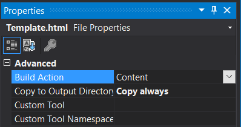
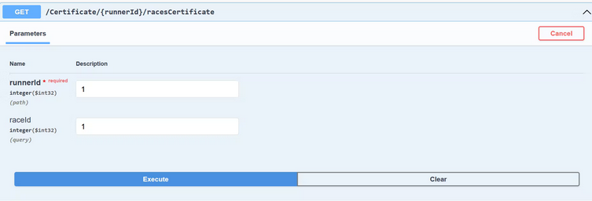
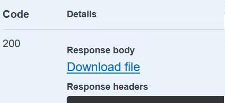
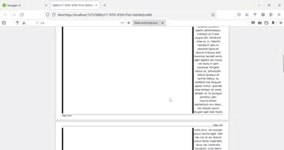

- [Introduction](#introduction)
- [Setup](#setup)
- [Project structure - Entities, Repository, DBContext](#project-structure---entities-repository-dbcontext)
- [Set up a local database](#set-up-a-local-database)
- [Formatting the HTML contents and working with Converter](#formatting-the-html-contents-and-working-with-converter)
  - [Generate the document](#generate-the-document)
  - [Issues and tips](#issues-and-tips)
    - [Using external css files - Wkhtmltopdf and Bootstrap](#using-external-css-files---wkhtmltopdf-and-bootstrap)
    - [The file generates for the first time and then shows raw text or runs for a long time, then crashes](#the-file-generates-for-the-first-time-and-then-shows-raw-text-or-runs-for-a-long-time-then-crashes)
    - [How to achieve page breaks and dynamically add new pages](#how-to-achieve-page-breaks-and-dynamically-add-new-pages)
    - [Blank page at the end of the document](#blank-page-at-the-end-of-the-document)
  - [Wrapping up: (unit) testing the pdf generator](#wrapping-up-unit-testing-the-pdf-generator)
- [Summary](#summary)

## Introduction
Many web apps return documents - think bank statements, certificates, or invoices. The task is not as easy as it sounds, but fortunately - there are options. In this post, I will demonstrate how to achieve that goal by converting an HTML page with dynamic content into a PDF document. This will be done using an open-source WkHtmlToPdf-DotNet library.

 ## Setup
I will focus on the pdf generation, so we will jump right into the project. Open Visual Studio and clone [the PdfGenerator repository](https://github.com/mariazieba/PdfGenerator). This is a simple web API with one endpoint that will return a pdf file, with a certificate that a runner has completed a run:


*Note that the HTML Template file placed in the Templates folder has the following set of properties - this is set to copy the file to the output directory so that we can access and read it.*



Now, time to add a necessary NuGet package to the project:

- Go to Tools- NuGet Package Manager - Manage NuGet Packages For Solution…
- Search for “WkHtmlToPdfDotnet”
- Install the following package - *note it has the most downloads and a recent update - some other forks are not maintained.*


## Project structure - Entities, Repository, DBContext
Once installed, we can take a look at the project structure. It is a simple web API with one GET endpoint that will return a .pdf file to download. It has three entity classes, a Runner, a Race, and a joint entity - RaceRunner. Because we need an additional property on the joint entity, we need to explicitly define it - hence the RaceRunner class.

*Note that if you don’t need any additional properties on the joint entity, the classes would look different. Race would have an ICollection of Runners, and Runner would have an ICollection of Races. Entity Framework would take care of generating the joint table in the database. Since we want to put the finish time on the document, we need another structure.*

```csharp
public class Runner
{
    public int Id { get; set; }
    public string FirstName { get; set; }
    public string LastName { get; set; }
    public DateTime DateOfBirth { get; set; }
    public ICollection<RaceRunner> RacesFinished { get; set; }
}
```

```csharp
public class Race
{
    public int Id { get; set; }
    public string Name { get; set; }
    public DateTime Date { get; set; }   
    public ICollection<RaceRunner> Participants { get; set; }
}
```

```csharp
public class RaceRunner
{
    public int RunnerId { get; set; }
    public Runner Runner { get; set; }
    public int RaceId { get; set; }
    public Race Race { get; set; }
    public TimeSpan TimeFinished { get; set; }
}
```

To make it into a database, we need [the following DbContext class](https://github.com/mariazieba/PdfGenerator/blob/main/PdfGenerator/Entities/RaceContext.cs)

Then, [a simple repository](https://github.com/mariazieba/PdfGenerator/blob/main/PdfGenerator/Services/IRepository.cs) with [implementation](https://github.com/mariazieba/PdfGenerator/blob/main/PdfGenerator/Services/MockRepository.cs) and the outline of our CertificateGenerator class:

```csharp
namespace PdfGenerator.Services
{
    public class CertificateGenerator
    {
        private IRepository _repository;
        public CertificateGenerator(IRepository repository)
        {
            _repository = repository;
        }
        public MemoryStream GetRaceCertificateStream(int runnerId, int raceId)
        {
            // TODO 
        }
    }
}
```

Of course, we need to register all of the required services. In .NET 6, there is no longer a Startup class, so everything is registered in the Program.cs class. The DbContext, Certificate Generator, and Swagger need to be set up here. **Note the SynchronizedConverter registered as a singleton - this is very important.**

```csharp
public class Program
    {
        public static IConfiguration Configuration { get; set; }
        public static void Main(string[] args)
        {
            var builder = WebApplication.CreateBuilder(args);

            // Add services to the container.

            builder.Services.AddControllers();
            builder.Services.AddDbContext<RaceContext>(cfg => cfg.UseSqlServer(Configuration.GetConnectionString("RaceDb"))); ;

            // Learn more about configuring Swagger/OpenAPI at https://aka.ms/aspnetcore/swashbuckle
            builder.Services.AddEndpointsApiExplorer();
            builder.Services.AddSwaggerGen();

            builder.Services.AddScoped<IRepository, RunRepository>();
            builder.Services.AddScoped<CertificateGenerator>();

            builder.Services.AddSingleton(typeof(IConverter), new SynchronizedConverter(new PdfTools()));

            Configuration = builder.Configuration;

            var app = builder.Build();

            // Configure the HTTP request pipeline.
            if (app.Environment.IsDevelopment())
            {
                app.UseSwagger();
                app.UseSwaggerUI();
            }

            app.UseHttpsRedirection();

            app.MapControllers();

            app.Run();
        }
    }
```

## Set up a local database
Last but not least: Using SQL Server Management Studio or another SQL explorer, create a local database for our data and paste the connection string into appsettings.json. The migration code should take care of the rest.

## Formatting the HTML contents and working with Converter
Now, back to the converter. Since we are working with the web app, we need to use a SynchronizedConverter.

The first conversion task is an HTML template with some variables. The HTML file is loaded to a string, so we get to use good old .Replace() method. This is important if you need some dynamic content. I maintained the convention of inserting variables in HTML in curly braces.

To load the file contents:

```csharp
var htmlcontent = File.ReadAllText(@"Services/Templates/Template.html");
```

Now, let’s replace the variables!

```csharp
StringBuilder htmlBuilder = new(htmlcontent);

htmlBuilder.Replace("{{ nameOfTheRun }}", raceRunnerData.Race.Name);
htmlBuilder.Replace("{{ runnersName }}", $"{runnerData.FirstName} {runnerData.LastName}");
htmlBuilder.Replace("{{ theFinishTime }}", $"{raceRunnerData.TimeFinished}");
```

The HTML string is ready, now we can start setting up the converter.

The [project README](https://github.com/HakanL/WkHtmlToPdf-DotNet) mentions two types of converters. Because this is a web app, we will use the SynchronizedConverter. 

```csharp
var converter = new SynchronizedConverter(new PdfTools());
```

Then, the most important part: the HtmlToPdfDocument.

```csharp
var doc = new HtmlToPdfDocument()
{
    GlobalSettings = {
        ColorMode = ColorMode.Color,
        Orientation = Orientation.Landscape,
        PaperSize = PaperKind.A4Small,
        DPI = 96
    },
    Objects = {
        new ObjectSettings() {
            PagesCount = true,
            HtmlContent = htmlBuilder.ToString(),
            WebSettings = { DefaultEncoding = "utf-8" }                        
        }
    }
};
```

Let’s take a look at some of the global settings.

1. ColorMode: by default, this is set to Color.
2. Orientation: Portrait or Landscape
3. PaperSize - standard paper sizes, e.g. A3, A4, etc.
4. You can set up some margins here (or use CSS for this purpose)
5. DPI - default is 96
6. Out - this parameter should be set only if you want to save the file locally. The project will return a stream for download from the API, so I omit that.

*Note: There are more properties to set here, such as image quality, document title, etc. They are very well described in their tooltips though, so I will not cover every single one.*

The Object Settings:

1. The most important one, of course, is the HtmlContent, where we pass the string with HTML structure,
2. WebSettings: encoding, enabling javascript, additional CSS files, and others,
3. Page count: this will enable or disable automatic page count. To actually show the page counting, you need to add the following lines in ObjectSettings (depending on where you want the numbers - footer, header on which side…)

```csharp
HeaderSettings = { FontSize = 9, Right = "Page [page] of [toPage]", Line = true, Spacing = 2 },
FooterSettings = { FontSize = 9, Left = "Page [page] of [toPage]", Line = true, Spacing = 2 }
```

Here is the output of the page count setting for the footer:


### Generate the document
Run the project. In the browser, select the only endpoint and click on 'Try it out'. Enter 1 in both fields, then click the 'Execute' button:



This is the result you should get. Download the file.



### Issues and tips
#### Using external css files - Wkhtmltopdf and Bootstrap
Just a quick showcase - insert the following style tag in the Template.html file:

```HTML
<link href="https://cdn.jsdelivr.net/npm/bootstrap@5.0.2/dist/css/bootstrap.min.css" rel="stylesheet" integrity="sha384-EVSTQN3/azprG1Anm3QDgpJLIm9Nao0Yz1ztcQTwFspd3yD65VohhpuuCOmLASjC" crossorigin="anonymous">
```

And now, let’s wrap the finish time in one of the Bootstrap components:

```html
<span class="badge bg-success">{{ theFinishTime }}</span>
```

And try to generate the document:


#### The file generates for the first time and then shows raw text or runs for a long time, then crashes
For multi-threaded and web applications, SynchronizedConverter should be used. Also, it should be **registered as a singleton** in the DI container:

```csharp
builder.Services.AddSingleton(typeof(IConverter), new SynchronizedConverter(new PdfTools()));
```

Problems will also occur if you use BasicConverter instead of Synchronized one. So, bottom line: for web apps, use a SynchronizedConverter registered as a singleton. It may not be with a project so simple as this one but may happen in real-life scenarios.

#### How to achieve page breaks and dynamically add new pages
Sometimes you need to generate every page separately with new content. For example, if we created a report for 5 runs, with every run on a separate page. To ensure correct page breaking, you can add a div with the following formatting:

```css
.new-page {
page-break-before: always;
}
```

Go to Template.html and add the CSS block to your style tag. Then, find a place just before the <body> tag closes and do the following - a.k.a. let’s deliberately break the layout a bit and make it overflow.

```html
{{ loremIpsum }}		
<div class="new-page"></div>
	</body>
</html>
```

Then, in CertificateGenerator class, add the following piece of code:

```csharp
htmlBuilder.Replace("{{ loremIpsum }}", @"
Lorem ipsum dolor sit amet, consectetur adipiscing elit.Morbi eu pulvinar nisl.Morbi posuere leo a nisl posuere feugiat.Vivamus elementum dui diam.Nullam varius porttitor diam et eleifend.Nunc viverra elementum iaculis.Nulla vel ex egestas, rutrum massa ac, mattis ipsum.Nullam sed vehicula tortor.Vestibulum ac mattis elit.In feugiat felis sed dolor maximus, et fermentum mauris varius.Nulla et eros varius, efficitur augue eget, venenatis justo.

Vestibulum sodales risus et urna tempor tincidunt.Lorem ipsum dolor sit amet, consectetur adipiscing elit.Curabitur vitae magna sapien.Maecenas blandit venenatis vehicula.Proin eget dui sodales, posuere sapien pellentesque, tristique ex.Fusce augue elit, hendrerit vitae ex in, lobortis hendrerit odio.In placerat ligula et lacinia tristique.Sed maximus laoreet enim, eget sagittis leo luctus vel.Nulla in sem euismod, fringilla lectus ut, sollicitudin metus.Quisque et lacinia metus, eu eleifend nisl.Aliquam sapien tortor, gravida vitae tempor sit amet, semper et mi.Quisque porttitor odio mauris.Etiam elementum orci dolor, nec aliquet ipsum feugiat eget.Sed mollis nulla arcu, vel suscipit purus lacinia eget.

Sed nec nisi et dui dictum luctus.Morbi imperdiet, lacus nec venenatis tincidunt, urna libero hendrerit lacus, et rutrum lorem velit bibendum ligula.Nam eu pharetra quam.Nullam dapibus condimentum neque, vehicula sagittis risus fringilla at.Sed egestas, risus in eleifend interdum, eros turpis lacinia tortor, non interdum orci lectus id nulla.Maecenas non lectus nibh.Aliquam cursus commodo risus quis pellentesque.Vivamus eu ipsum et risus tincidunt consequat.Pellentesque venenatis ac lectus a posuere.Vestibulum vitae metus blandit nibh viverra hendrerit eu et elit.In consectetur posuere justo, id pretium tortor placerat et.Ut nec facilisis lorem, non molestie mi.Ut blandit libero quis elit congue tempor.Nam vitae est mattis, euismod felis quis, venenatis risus.Cras dapibus, nisl in cursus tempor, nibh lectus sollicitudin quam, euismod bibendum nibh odio at mi.

Vestibulum fringilla, orci sit amet placerat sollicitudin, dolor ante placerat leo, sed posuere nibh arcu sed erat.Cras congue dolor vel neque finibus, tincidunt sagittis mauris lacinia.Vestibulum ornare mauris lectus, in pulvinar ante mollis vel.Pellentesque habitant morbi tristique senectus et netus et malesuada fames ac turpis egestas.Suspendisse potenti.Ut nec nulla sed massa maximus tincidunt.Maecenas pretium imperdiet nunc ut vehicula.Pellentesque in ipsum lacinia tellus venenatis imperdiet non nec ex.Nullam cursus sit amet erat in congue.

Pellentesque habitant morbi tristique senectus et netus et malesuada fames ac turpis egestas.Curabitur ullamcorper, libero ac semper egestas, turpis turpis blandit lacus, at vehicula nibh diam a quam.Nullam sollicitudin ex purus, sed pulvinar velit interdum ut.Lorem ipsum dolor sit amet, consectetur adipiscing elit.Nullam lectus ante, cursus vitae orci in, venenatis feugiat metus.Phasellus fringilla nibh eget mi ornare volutpat.Aliquam efficitur orci eu massa euismod, a imperdiet sapien pellentesque.Aenean consectetur enim vitae elit aliquam, vitae ultrices nisi dignissim.Sed sodales diam vitae tortor dapibus tempus.Ut sollicitudin diam nec eleifend lobortis.Nunc vestibulum dolor id enim venenatis, vitae elementum orci laoreet.Suspendisse eu imperdiet orci, vel.");
```

Generate the document now - you will see how the page breaking works.



#### Blank page at the end of the document
You generate a document and a blank page is added at the end of it. This is not necessarily a deal-breaker, but if you want it out, make sure the bottom margin on the last page is set to 0.

### Wrapping up: (unit) testing the pdf generator
If you use your generator in an API, I would suggest unit testing the controller and checking if the result you get is a FileStreamResult. If you care about the file name, check for it, too.

This is a sample test class - it only checks if the action result is correct. Real-life scenarios come with more logic in services and this is what should be tested in the first place.

```csharp
[TestClass]
    public class CertificateControllerTests
    {
        private readonly Mock<IRepository> _repository;
        private readonly Mock<CertificateGenerator> _certificateGenerator;
        private readonly CertificateController _certificateController;

        public CertificateControllerTests()
        {
            _repository = new Mock<IRepository>();
            _certificateGenerator = new Mock<CertificateGenerator>(_repository.Object);
            _certificateController = new(_certificateGenerator.Object);

        }
        [TestMethod]
        public void Endpoint_Should_ReturnFileStreamResult()
        {
            var race = new Race()
            {
                Id = 1,
                Date = DateTime.Now.AddDays(-10),
                Name = "Run Fast For Your Mother: A Mother's Day Race"
            };

            var runner = new Runner() { Id = 1, DateOfBirth = new DateTime(2000, 1, 1), FirstName = "Hermione", LastName = "Granger" };

            var raceRunner = new RaceRunner() { RunnerId = 1, Runner = runner, Race = race, RaceId = 1, TimeFinished = new TimeSpan(0, 54, 36) };

            runner.RaceRunners = new List<RaceRunner>() { raceRunner };
            race.RaceRunners = new List<RaceRunner>() { raceRunner }; 

            _repository.Setup(x => x.GetRunnerData(It.IsAny<int>())).Returns(runner);
            
            var result = _certificateController.GetRaceCertificate(1, 1);

            Assert.IsInstanceOfType(result, typeof(FileStreamResult));
            Assert.AreEqual("Congratulations.pdf", result.FileDownloadName);
        }
    }
```

## Summary
When I started working on a .pdf generating functionality, I thought I would have to go with a paid solution (like Syncfusion, or ITextSharp). Sure, they are smoother and probably a better fit in some scenarios, but WkHtmlToPdf-dotnet is easy to use and implement if you don’t need anything specific. That’s why I decided to give it a shot before I paid for the license.

Another free option I found was PdfSharp - I even found a [StackOverflow post](https://stackoverflow.com/questions/564650/convert-html-to-pdf-in-net#31944740) detailing why it’s better. However, I couldn’t get it to work with images and external CSS sheet - and I needed bootstrap. Both of the libraries are still regularly maintained with many questions answered on SO, if you need some help. The choice is ultimately yours.
